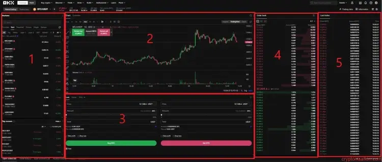
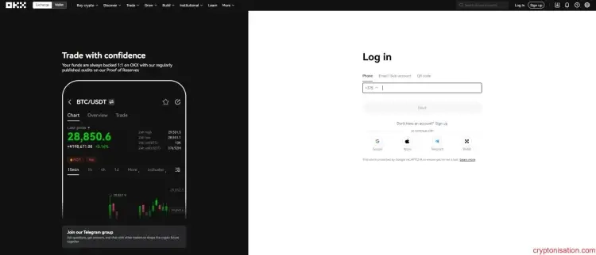
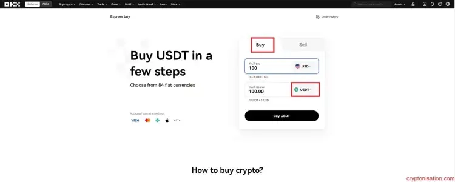
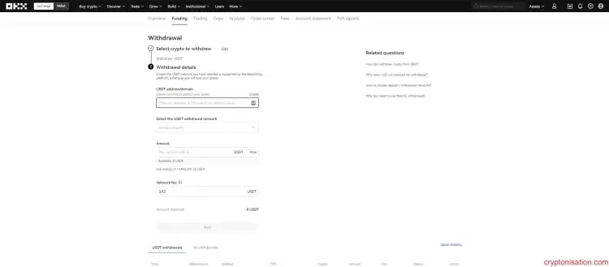
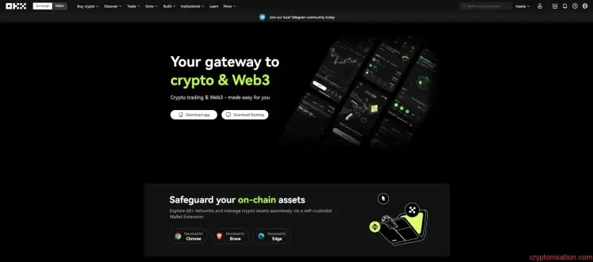

# OKX完全指南：2025新手必看的交易所深度测评

想在加密货币市场找到一个既安全又好用的交易平台？手续费太高让你肉疼？担心平台跑路或被黑客攻击？别急，今天我们来聊聊OKX这个老牌交易所。它凭借超低手续费、储备金透明公开和强大的交易工具，在全球交易量排行榜上始终占据前五位置。无论你是刚入门的新手还是经验丰富的交易者，这篇文章都会告诉你OKX到底适不适合你。

---

## OKX是什么？一个简单的开场

OKX（以前叫OKEx）是2017年成立的老牌加密货币交易所，总部在塞舌尔。平台每天的交易量超过30亿美元，支持近700个交易对。

这家交易所最大的特点是什么？三个字：**全面**。

现货、合约、期权，该有的都有。想保守点做现货？没问题。想玩杠杆追求刺激？最高100倍杠杆等着你。还有机器人交易、跟单功能、质押挖矿——基本上你能想到的加密货币赚钱方式，OKX都给你准备好了。

听起来很厉害对吧？但真的好用吗？我们一项一项看。

---

## 交易条件：手续费和市场

### 手续费有多低？

说实话，OKX的手续费确实便宜。

现货交易的基础费率是：
- **挂单方（Maker）**：0.08%
- **吃单方（Taker）**：0.10%

这是什么水平？在主流交易所里算是很有竞争力的。而且如果你持有平台币OKB或者交易量大，费率还能往下降。

合约交易更便宜：
- **挂单方**：0.02%
- **吃单方**：0.05%

对比某些平台动不动0.2%的费率，这个价格真的良心。

### 支持哪些市场？

OKX支持这些交易方式：

1. **现货市场**：最基础的买卖，支持10倍杠杆
2. **合约市场**：永续合约和交割合约都有，杠杆最高100倍
3. **P2P市场**：直接跟其他用户买卖，支持100多种支付方式，零手续费
4. **大宗交易（OTC）**：适合大资金用户

现货市场有个小遗憾：**不支持法币交易对**。你不能直接用美元或人民币买比特币，得先通过P2P或者第三方渠道充值稳定币。

不过合约市场倒是有BTC/USD、ETH/USD这些美元计价的合约。

---

## 交易界面：复杂但强大

打开OKX的交易界面，新手可能会懵一下——信息量确实有点大。

左边是交易对列表和深度图，中间是K线图，右边是订单簿和交易面板。习惯了就好，信息密度高意味着功能全面。

### 订单类型很丰富

OKX支持的订单类型包括：

- **市价单/限价单**：基础款
- **止盈止损（TP/SL）**：自动锁定利润或止损
- **追踪止损**：价格反转时自动平仓
- **冰山委托**：把大单拆成小单，避免影响市场
- **TWAP订单**：按时间加权平均价格执行，适合大资金

这些工具对专业交易者来说很实用，但新手可能需要点时间摸索。

---

## 安全性：做得怎么样？

加密货币交易所最怕的就是被黑客盯上。OKX在安全方面投入不少，但也不是没出过问题。

### 用户资产怎么保护？

OKX使用**冷钱包+热钱包**的存储方案。大部分用户资产存在离线的冷钱包里，私钥备份存放在不同国家的银行保险柜。热钱包则用特制的半自动设备管理，没联网的情况下操作私钥。

平台还搞了个**储备金证明（Proof of Reserves）**，每个月公开两次储备数据。你可以在官网或者第三方平台（比如GeckoTerminal）查看平台是否真的1:1持有用户资产。

此外还有**风险保护基金**，万一平台被黑，这笔钱用来赔偿受影响的用户。

### 账户安全设置

OKX提供的账户保护措施包括：

- 生物识别登录（指纹/面容）
- 双重验证（邮箱+手机）
- 谷歌验证器
- 防钓鱼码
- 设备管理和登录历史

这些功能都挺实用的，建议全开。

### 有没有被黑过？

说实话，OKX历史上确实遭遇过几次黑客攻击，但损失都不算大。平台每次都能及时控制局面，没让用户承担太大损失。

---

## 怎么开始使用OKX？

### 注册很简单

1. 👉 [点击进入OKX官网](https://www.okx.com/join/62834398)
2. 点右上角的"注册"按钮
3. 输入邮箱和密码
4. 验证邮箱里收到的6位验证码

注册完就能进入账户了。

### 身份验证必须做

想要交易，必须先完成KYC验证（身份认证）。

点击右上角头像 → 选择"Verification" → 按提示上传身份证件和自拍。

通常24小时内审核完成，快的话几个小时就搞定。

---

## 充值和提现

### 怎么充值？

OKX支持多种充值方式：

1. **加密货币充值**：从其他钱包转账，免手续费
2. **信用卡/借记卡**：Visa、Mastercard都行，手续费0.67%-7.18%
3. **P2P购买**：支持支付宝、微信、银行转账等100多种支付方式

以Visa卡购买USDT为例：

进入"Buy Crypto" → 选择"Express buy" → 输入金额 → 选择USDT → 选择Visa卡支付 → 完成付款

### 怎么提现？

提现流程：

1. 进入"Assets" → "Withdraw"
2. 选择要提现的币种（比如USDT）
3. 选择提现方式（链上转账或内部转账）
4. 输入接收地址和提现金额
5. 选择网络（注意要和目标钱包网络一致！）
6. 确认提现

提现手续费根据网络拥堵情况浮动，会在提现前显示。

---

## 额外功能：不只是交易

### 交易机器人

OKX内置了14种自动交易策略，包括：

- **DCA机器人**：定投策略
- **网格机器人**：区间震荡套利
- **信号机器人**：跟随技术指标交易
- **套利机器人**：跨市场套利

如果你懂编程，还能自己开发策略。

### 跟单交易

不会交易怎么办？直接复制别人的操作。

OKX的跟单功能让你选择表现好的交易员，自动复制他们的交易。当然，盈亏自负，交易员会抽取一定比例的利润分成。

### OKX Earn：躺赚功能

如果你不想主动交易，可以试试OKX Earn平台：

- **活期存款**：随存随取，年化收益3.79%-17.68%
- **定期存款**：锁仓3-120天，年化收益最高139%
- **质押挖矿**：参与流动性挖矿，年化收益0.01%-1.94%
- **结构化产品**：高风险高收益的投资产品

风险和收益成正比，选择时要谨慎。

---

## 移动端体验

OKX有iOS和Android官方App，功能和网页版基本一致。界面优化得不错，用手机交易也很顺畅。

你可以在官网底部扫描二维码下载。

---

## 客服支持

OKX的客服是7×24小时在线的。你可以通过：

- **在线聊天**：网站右下角的蓝色按钮，支持20多种语言
- **邮件**：support@okx.com
- **帮助中心**：官网底部的"Support Center"，有常见问题解答

实测客服响应速度还可以，中文服务也没问题。

---

## 总结：OKX适合你吗？

说了这么多，OKX到底值不值得用？

**适合你，如果你：**
- 想要低手续费交易
- 需要丰富的交易工具（合约、期权、机器人等）
- 在意平台透明度和储备金证明
- 想尝试多种加密货币赚钱方式

**可能不适合，如果你：**
- 是完全的新手，觉得界面太复杂
- 只想用法币直接买币（现货市场不支持法币对）
- 对平台历史上的安全事件有顾虑

总的来说，OKX是一个功能全面、费用低廉、安全性相对可靠的交易所。对于想认真玩加密货币的人来说，这是个值得考虑的选择。

想开始体验OKX的低费率和丰富功能？👉 [使用邀请码62834398注册OKX](https://www.okx.com/join/62834398)，解锁更多交易福利，开启你的加密货币交易之旅吧。

---

## 常见问题

**Q: OKX安全吗？**
A: OKX使用冷热钱包分离存储、定期公布储备金证明、设有风险保护基金。虽然历史上遭遇过黑客攻击，但都及时控制了损失。整体安全性在行业内属于中上水平。

**Q: OKX支持中文吗？**
A: 支持，但部分页面的翻译质量有待提高。

**Q: 新手适合用OKX吗？**
A: OKX功能强大但界面复杂，新手需要一定学习时间。如果你愿意花时间摸索，OKX的低费率和丰富工具很值得。

**Q: OKX有哪些优势？**
A: 低手续费、高流动性、丰富的交易工具、透明的储备金证明、多样化的赚钱方式。

**Q: OKX有什么缺点？**
A: 现货市场不支持法币交易对、部分语言翻译不准确、历史上有安全事件。
